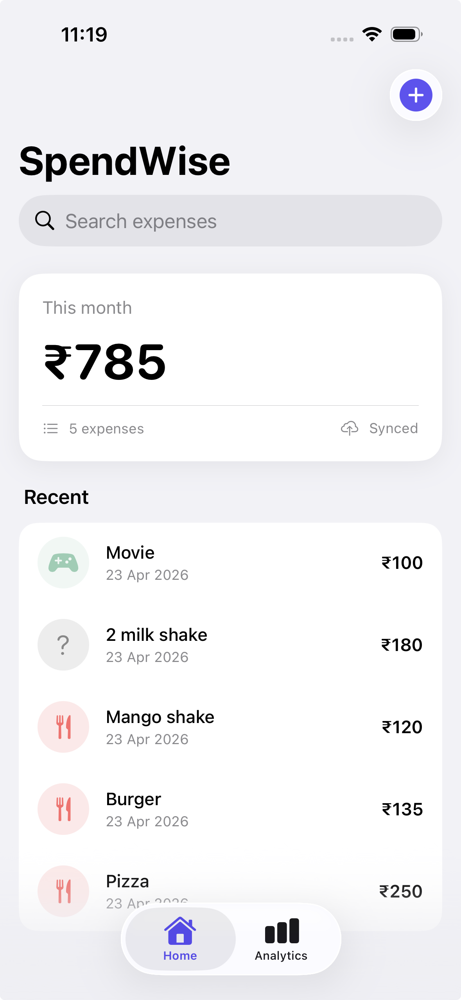
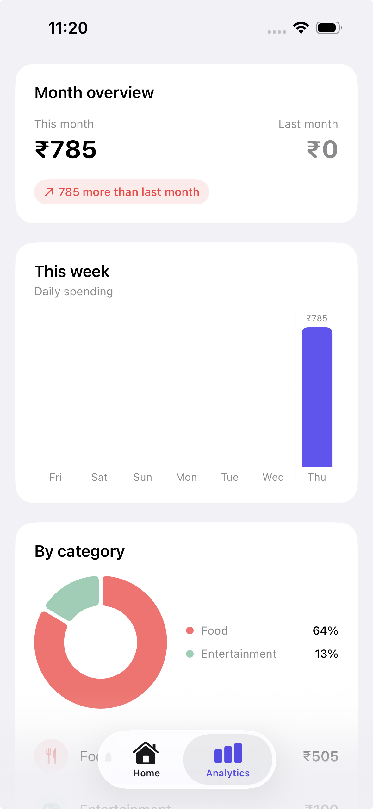
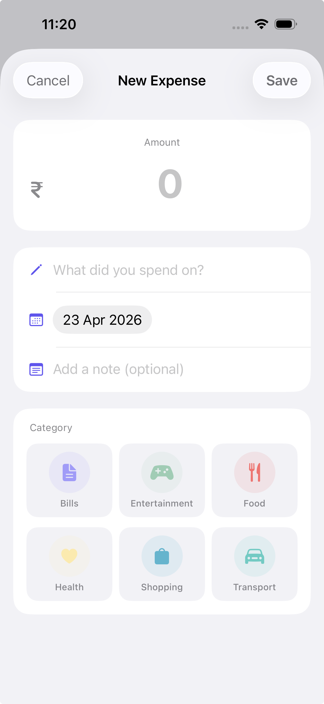
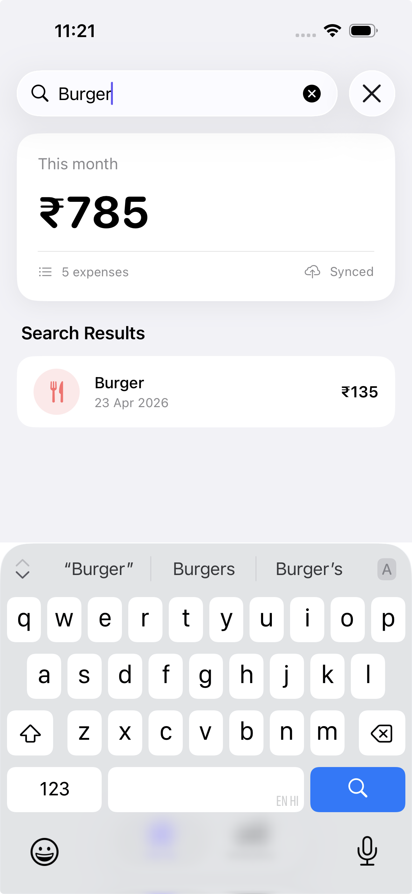

# SpendWise 💰

SpendWise is a premium personal finance tracker built with SwiftUI. It helps users track their daily expenses, visualize spending trends through charts, and manage their

## Screenshots

<p align="center">
  
   
  
  
</p>

## Project Structure
```text
SpendWise/
├── Models/              # CoreData properties and Chart models
├── ViewModels/          # Business logic and View-specific data
│   └── Dashboard/       # Dashboard and Analytics logic
├── Views/               # SwiftUI components and screens
│   ├── Dashboard/       # Dashboard-specific components
│   └── Expenses/        # Expense creation components
├── Utilities/           # Extensions and Sample Data
├── Persistence.swift    # CoreData setup (Local storage)
└── SpendWiseApp.swift   # App entry point
```

## Features
- **Dashboard**: Quick overview of monthly spending and recent transactions with a beautiful card-based UI.
- **Analytics**: Deep insights into your spending habits with donut charts for categories and bar charts for weekly trends.
- **Search**: Powerful search to find any past expense instantly by title or category.
- **Expense Management**: Minimalist form to add expenses with category icons and haptic feedback.
- **Dark Mode**: High-contrast dark mode support for late-night tracking.

## Tech Stack
- **UI**: SwiftUI (Modern Declarative UI)
- **Database**: Core Data (Local storage for privacy and speed)
- **Visuals**: Swift Charts (Native iOS charting)
- **Architecture**: MVVM (Clean and maintainable code)

## Installation
1. Clone the repository: `git clone https://github.com/Ratnam-1021/SpendWise.git`
2. Open `SpendWise.xcodeproj` in Xcode.
3. Build and run on a Simulator or iPhone!

---
Developed by Ratnam Singh.
